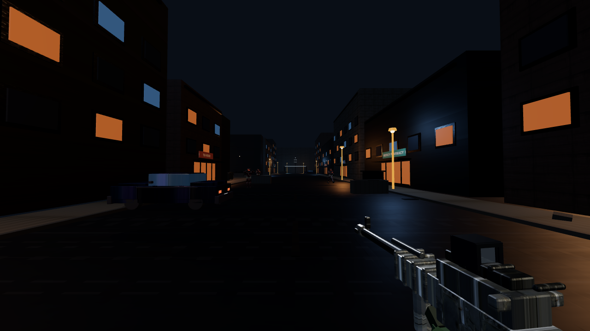

# Grok of Duty

Browser FPS — **Three.js r180 + Vite (WebGL2)**. Night rain-slicked street, one rifle,
one enemy archetype. Built for cohesion and feel over feature count.



## Quick start

```bash
npm install
npx playwright install chromium   # for capture/perf tools
npm run assets                    # optional: rebuild Blender hero meshes
npm run dev
```

**Play:** click to lock · WASD · Shift sprint · Space jump · LMB fire · **RMB / E ADS** (holo optic) · R reload.  
Death → KIA overlay → auto-respawn ~2.5s.

## Quality gate

```bash
npm run gate          # build + capture + perf
node tools/diff.mjs   # vs locked baselines/
```

## Docs

| File | Purpose |
|------|---------|
| [`AGENTS.md`](AGENTS.md) | Build/test, architecture, traps (agents) |
| [`docs/BRIEF.md`](docs/BRIEF.md) | Original product brief |
| [`docs/LESSONS.md`](docs/LESSONS.md) | Lessons from the first full build session |
| [`docs/FOLLOWUPS.md`](docs/FOLLOWUPS.md) | Optional next steps (not blocking) |

## Hybrid art

Hero meshes (rifle, enemy, dumpster, car) are baked with **Blender** + **Imagine**
textures under `public/models/`. Runtime dependency is still **three only**.

```bash
npm run assets   # tools/blender/export_hero_meshes.py → public/models/*.glb
```

## Stack

- Engine: fixed step 120Hz, lockstep for tools, seeded RNG
- Systems: physics, materials, sky, world, player, weapons, ai, fx, audio, ui
- Tools: `tools/capture.mjs`, `diff.mjs`, `perf.mjs`
